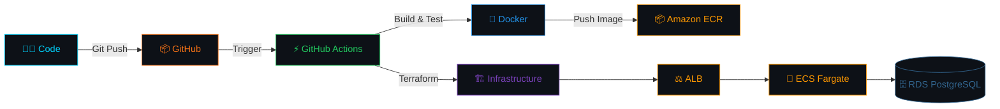

<div align="center">

<!-- ANIMATED HEADER -->


<!-- DEVOPS INFINITY LOOP GIF -->


<!-- TYPING ANIMATION -->
<a href="https://git.io/typing-svg">
  
</a>

<!-- SOCIAL BADGES -->
<p>
  <a href="https://github.com/saichandram-sadhu"></a>
  <a href="https://www.linkedin.com/in/saichandram-sadhu-9980a2357/"></a>
  <a href="mailto:saichandram.sadhu.it@gmail.com"></a>
  
</p>

</div>

<!-- ANIMATED LINE -->


## 🖥️ `> whoami`

```js
const saichandram = {
    role: "DevOps Engineer & Cloud Infrastructure Specialist",
    location: "India 🇮🇳",
    current_focus: "Production-Grade AWS Infrastructure & CI/CD Pipelines",
    building: ["ThreatVision — Full DevOps Pipeline on AWS",
               "AI-Powered Intrusion Detection Systems",
               "SOC Automation & Threat Intelligence Platforms"],
    philosophy: "Automate Everything. Ship Faster. Sleep Better. 🚀",
    open_for: "DevOps | Cloud | Security Collaborations"
};
```


## ♾️ DevOps & CI/CD Pipeline

<div align="center">



</div>


## 🛠️ DevOps Arsenal & Toolkit

<div align="center">

### ☁️ Cloud Platforms
<p>
  
  
  
</p>

### 🐳 Containers & Orchestration
<p>
  
  
  
  
</p>

### ⚡ CI/CD & IaC
<p>
  
  
  
  
</p>

### 📊 Monitoring & Observability
<p>
  
  
  
  
</p>

### 🔐 Security & Networking
<p>
  
  
  
  
  
</p>

### 💻 Languages & OS
<p>
  
  
  
  
  
  
  
  
</p>

### 🗄️ Databases
<p>
  
  
  
  
</p>

</div>


## 🚀 Featured Project — ThreatVision

<div align="center">

<a href="https://github.com/saichandram-sadhu/threatvision">
  
</a>

</div>

> **ThreatVision** — A production-grade **Threat Intelligence Platform** deployed on AWS using a complete DevOps pipeline.

<table>
<tr>
<td width="50%">

### 🏗️ Infrastructure Stack
| Component | Technology |
|:----------|:-----------|
| **Compute** | ECS Fargate (Serverless) |
| **Registry** | Amazon ECR |
| **Database** | RDS PostgreSQL |
| **Load Balancer** | Application LB |
| **IaC** | Terraform |
| **CI/CD** | GitHub Actions |
| **Containers** | Docker Multi-Stage |
| **Region** | ap-south-1 (Mumbai) |

</td>
<td width="50%">

### ⚡ DevOps Highlights
- 🐳 **Dockerized** — Multi-stage builds for minimal images
- ♾️ **CI/CD** — Auto deploy on push via GitHub Actions
- 🏗️ **IaC** — Full infrastructure as Terraform code
- 🚀 **Serverless** — ECS Fargate, zero EC2 management
- 🔒 **Secure** — Private VPC, encrypted ECR, IAM roles
- 📊 **Monitored** — CloudWatch + real-time dashboards
- 🗄️ **Managed DB** — RDS PostgreSQL in private subnet
- ⚖️ **HA** — Multi-AZ ALB for high availability

</td>
</tr>
</table>


## 🗂️ Other Projects

<div align="center">

<a href="https://github.com/saichandram-sadhu/AI-POWERD-IDS">
  
</a>
<a href="https://github.com/saichandram-sadhu/PhishGuard-SOC-Dashboard">
  
</a>
<a href="https://github.com/saichandram-sadhu/passfort">
  
</a>
<a href="https://github.com/saichandram-sadhu/saichandram-terraform-public-repo">
  
</a>

</div>


## 📊 GitHub Analytics

<div align="center">

<a href="https://github.com/saichandram-sadhu">
  
</a>
<a href="https://github.com/saichandram-sadhu">
  
</a>

<br><br>


<br><br>


</div>


## 🐍 Contribution Graph

<div align="center">
  <picture>
    <source media="(prefers-color-scheme: dark)" srcset="https://raw.githubusercontent.com/saichandram-sadhu/saichandram-sadhu/output/github-contribution-grid-snake-dark.svg">
    <source media="(prefers-color-scheme: light)" srcset="https://raw.githubusercontent.com/saichandram-sadhu/saichandram-sadhu/output/github-contribution-grid-snake.svg">
    
  </picture>
</div>

<br>

<div align="center">
  
</div>


## 🤝 Let's Connect

<div align="center">
  <a href="https://www.linkedin.com/in/saichandram-sadhu-9980a2357/">
    
  </a>
  <a href="https://github.com/saichandram-sadhu">
    
  </a>
  <a href="mailto:saichandram.sadhu.it@gmail.com">
    
  </a>
</div>

<br>

<div align="center">
  <i>💡 Open to collaborations in DevOps, Cloud Infrastructure, CI/CD Pipelines & Security Operations!</i>
</div>

<br>

<!-- FOOTER -->
<div align="center">
  <p>
    
    
  </p>
  
  
</div>
